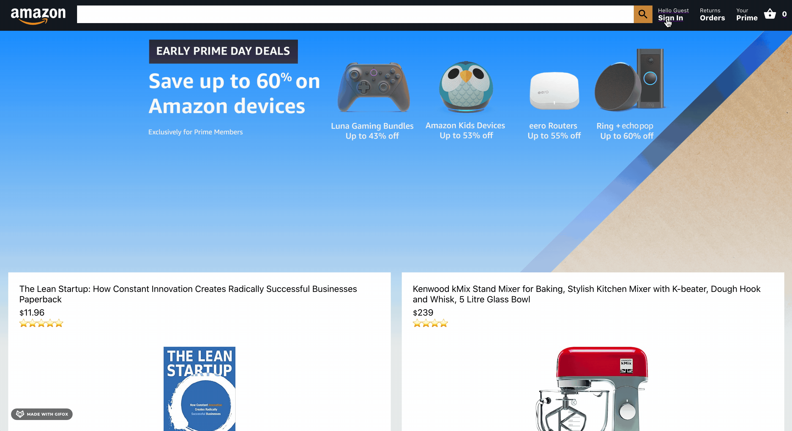

# Welcome to the Amazon Clone!

## Take a Look

# Amazon Clone App

Welcome to the Amazon Clone, a full-stack e-commerce application built with React, Firebase, and Stripe. The Amazon Clone is a work in progress, and is not yet able to process payments or process orders. The Amazon Clone is a great way to learn about React, Firebase, and Stripe, and it is also a great starting point for creating other e-commerce applications.

## Features

- Users can create an account and log in.
- Users can add items to their basket.
- Users can remove items from their basket.
- Users can view their basket.
- Users can view their subtotal.

## Technologies Used

The Amazon Clone incorporates the following technologies: React, Firebase, Stripe, and Material UI.

## Getting Started

To start using the Amazon Clone, follow these steps:

1. Fork and clone this repository in your command-line interface (CLI).
2. Navigate to the directory you just cloned.
3. Run `npm install` to install the necessary components.
4. Run `npm start` to launch the app on your local machine.

## Future Updates

The Amazon Clone is an ongoing project, and we have exciting updates planned for the future, including:

- Using Stripe to process payments.
- Adding order history to the Firebase and Stripe databases.

## Contribution Guidelines

Contributions to the Amazon Clone are welcome! If you would like to contribute, please follow these guidelines:

1. Fork the repository and create a new branch for your feature or bug fix.
2. Make your changes and thoroughly test them.
3. Create a pull request with a detailed description of your changes.
4. Ensure that your code follows the project's coding standards and is well-documented.
5. The project maintainers will review your contribution and provide feedback if necessary.

## About Me

**Duncan Wood**  
Connect with me on LinkedIn: [LinkedIn](https://www.linkedin.com/in/duncanwoodpro/)  
Check out my GitHub profile: [GitHub](https://github.com/Duncan-Wood)
And here is my Portfolio: [Portfolio](https://duncanwoodpro.netlify.app/)
